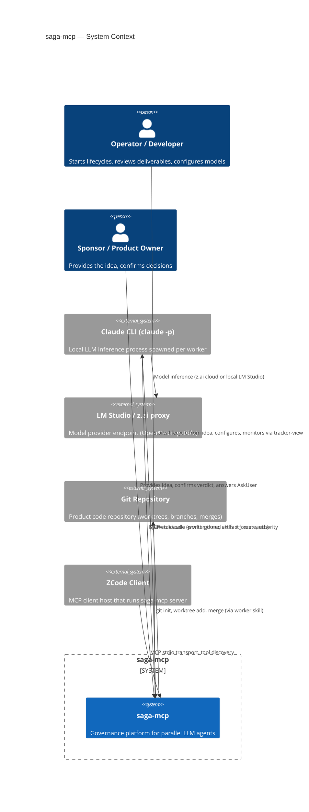
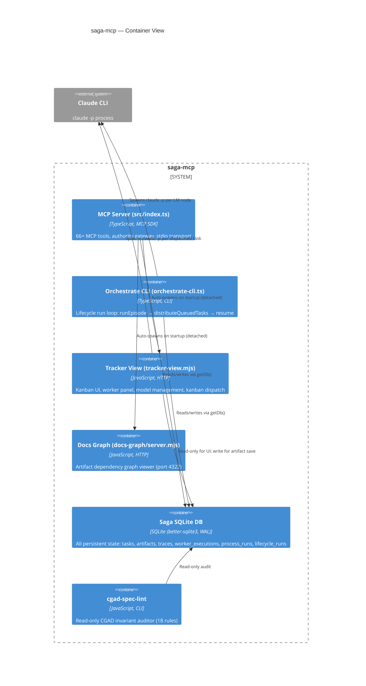

# 01 — As-Is C4 (Context / Container / Component) + Architecture Violations & Anti-Pattern Report

> Phase 1 — System Discovery. Every claim is grounded in specific files from the saga4 branch.

## 1.1 As-Is C4 — System Context



### External actors and systems

| Actor/System | Role | Evidence |
|---|---|---|
| Operator | Starts lifecycles (`startProductLifecycleFromIdea`), monitors via tracker-view (port 4321), configures models | `src/app/start-product-lifecycle-from-idea.ts`, `tracker-view/tracker-view.mjs` |
| Sponsor | Provides idea, confirms verdict (AskUser), answers human_requests | `skills/saga-kickstart/SKILL.md` (verdict+override), `src/tools/dispatcher.ts` (`worker_ask_need/done`) |
| Claude CLI (`claude -p`) | One-shot LM execution process spawned per worker task | `tracker-view/claude-runner.mjs:680-1114` (`launch()`) |
| LM Studio / z.ai proxy | Model inference endpoint | `tracker-view/claude-runner.mjs:707-718` (`getActiveModel`, `--model`, `--effort`) |
| Git | Product code repository (worktrees, merges, branch isolation) | `src/tools/dispatcher.ts:67-81` (`worktreeBranch`, `worktreePath`) |
| ZCode Client | MCP host that discovers and connects to saga-mcp server | `src/index.ts:141-153` (StdioServerTransport, ListToolsRequestSchema) |

---

## 1.2 As-Is C4 — Container



### Container inventory

| Container | Technology | Port | Entry point | Evidence |
|---|---|---|---|---|
| MCP Server | TypeScript + MCP SDK 1.26 | stdio | `src/index.ts` | 66+ tool definitions from 28 handler files |
| Orchestrate CLI | TypeScript CLI | n/a | `src/orchestrate-cli.ts` | `node dist/orchestrate-cli.js <projectId> <epicId> [--concurrency=N]` |
| Tracker View | JavaScript (.mjs) | 4321 | `tracker-view/tracker-view.mjs` | 5605 lines: HTTP server + kanban UI + markdown renderer + dispatch |
| Docs Graph | JavaScript (.mjs) | 4322 | `tracker-view/docs-graph/server.mjs` | Artifact graph visualization |
| Saga SQLite DB | better-sqlite3 12.6, WAL mode | file | `src/db.ts` (`getDb()`) | ~30 tables, 1078-line schema (`src/schema.ts`) |
| cgad-spec-lint | JavaScript CLI | n/a | `tools/cgad-spec-lint.mjs` | 18 rules (R1-R18), read-only |

---

## 1.3 As-Is C4 — Component (key containers)

```mermaid
C4Component
    title saga-mcp — MCP Server Component View

    Container_Boundary(mcpServer, "MCP Server")

    Component(authorityGateway, "Authority Gateway", "authorizeSagaToolCall", "Per-call enforcement of frozen execution_context")
    Component(toolsLayer, "Tools Layer (28 files)", "src/tools/*.ts", "MCP tool definitions + handlers")
    Component(dbAccess, "DB Access", "src/db.ts", "Global SQLite singleton (getDb, closeDb)")

    Container_Boundary(processModules, "Process Modules")

    Component(genericFlow, "GenericFlowExecutor", "src/process-modules/application/generic-flow-executor.ts", "Data-driven Flow walker (1482 lines)")
    Component(lifecycleOrch, "LifecycleOrchestrator", "src/process-modules/application/lifecycle-orchestrator.ts", "Declarative stage routing, lease watchdog")
    Component(nodeExecutors, "Node Executors", "3 executors", "LmNodeExecutor, KernelNodeExecutor, HumanNodeExecutor")

    Component(discovery, "Discovery Module", "modules/discovery/", "Idea → certificate (6 kernel handlers)")
    Component(formalization, "Formalization Module", "modules/formalization/", "PRD/UC/AC/SRS → solution contract (7 handlers)")
    Component(development, "Development Module", "modules/development/", "Task graph → verified integration bundle")
    Component(delivery, "Delivery Module", "modules/delivery/", "Preflight → approval → publish → observe")

    Container_Boundary(workDispatch, "Work Dispatch")

    Component(workAssignment, "Work Assignment Core", "src/lifecycle/work-assignment-core.ts", "findNextClaimable, single-writer for task status")
    Component(atomicRelease, "Atomic Release", "src/lifecycle/atomic-release.ts", "Terminalize execution + release task in one tx")
    Component(stuckPolicy, "Stuck Policy", "src/lifecycle/stuck-policy.ts", "Pure decideStuckAction function")
    Component(workerExecutions, "Worker Executions", "src/worker-executions.ts", "Registry, fence, reconciliation (reaper)")

    Rel(toolsLayer, authorityGateway, "Every CallToolRequest passes through")
    Rel(authorityGateway, dbAccess, "Reads worker_executions + frozen context")
    Rel(toolsLayer, dbAccess, "Direct SQL via getDb()")
    Rel(workAssignment, dbAccess, "BEGIN IMMEDIATE transactions")
    Rel(genericFlow, nodeExecutors, "Dispatches by node.kind")
    Rel(nodeExecutors, workAssignment, "LmNodeExecutor pre-assigns cards")
    Rel(genericFlow, discovery, "Walks discovery Flow (via handler registry)")
    Rel(genericFlow, formalization, "Walks formalization Flow")
    Rel(genericFlow, development, "Walks development Flow")
    Rel(genericFlow, delivery, "Walks delivery Flow")
    Rel(lifecycleOrch, genericFlow, "Executes module per stage")
```

### Component inventory (selected high-value components)

| Component | File(s) | LOC | Responsibility |
|---|---|---|---|
| Authority Gateway | `src/saga3/authority/authorize-saga-tool-call.ts` | 299 | Validates frozen execution_context on every MCP call |
| GenericFlowExecutor | `src/process-modules/application/generic-flow-executor.ts` | 1482 | Data-driven Flow walker; walks nodes, persists NodeRuns, crash-resume |
| LifecycleOrchestrator | `src/process-modules/application/lifecycle-orchestrator.ts` | 821 | Declarative stage routing, lease watchdog, transition budget |
| LmNodeExecutor | `src/process-modules/application/node-executors/lm-node-executor.ts` | 837 | WorkIntent projection, assignTask fence, spawn worker, poll loop |
| Work Assignment Core | `src/lifecycle/work-assignment-core.ts` | 413 | `findNextClaimable` — atomic card claim + fence creation |
| Atomic Release | `src/lifecycle/atomic-release.ts` | 403 | Terminalize execution + release task in one BEGIN IMMEDIATE tx |
| Stuck Policy | `src/lifecycle/stuck-policy.ts` | 339 | Pure `decideStuckAction` — reaper decision tree |
| Worker Executions | `src/worker-executions.ts` | 649 | Registry, fence assertion, reaper reconciliation |
| Dispatcher (MCP) | `src/tools/dispatcher.ts` | 1610 | worker_next/worker_done/merge_acquire/merge_release/ask_need/ask_done/worker_health |
| Formalization Installation | `src/process-modules/modules/formalization/formalization-installation.ts` | 2029 | 7 kernel handlers + exact-candidate-acceptance gates |
| Tracker View | `tracker-view/tracker-view.mjs` | 5605 | HTTP server, kanban UI, markdown renderer, dispatch, recovery |
| cgad-spec-lint | `tools/cgad-spec-lint.mjs` | 1380 | 18 deterministic CGAD enforcement rules |

---

## 1.4 Architecture Violations & Anti-Pattern Report

### Boundary violations

| # | Violation | Evidence | Severity |
|---|---|---|---|
| V1 | **God Object: `tracker-view.mjs`** — HTTP server, HTML renderer, kanban dispatch, artifact resolver, recovery, heartbeat, model management all in one 5605-line file. Violates SRP. | `tracker-view/tracker-view.mjs` (5605 lines, single file) | High |
| V2 | **Cross-context import via dynamic import** — `createLegacySettlementBridge` in `discovery-installation.ts` uses `await import('../../../saga3/...')` to bypass the static dependency ratchet. The runtime edge exists but the scanner does not see it. | `src/process-modules/modules/discovery/discovery-installation.ts:155-175` | Medium |
| V3 | **Type safety bypass in composition root** — `installationRegistry.register(inst as any)` casts away type checking at the single most critical wiring point. | `src/app/product-lifecycle-runtime.ts:601` | Medium |
| V4 | **Global DB singleton accessed across layers** — `getDb()` is called from MCP tools, lifecycle, infrastructure, composition root. The `process-modules/domain/` layer stays clean, but `process-modules/application/` and `process-modules/persistence/` import it directly. | `src/db.ts:11-21` (global singleton); `src/tools/*.ts` (28 files each call `getDb()`) | Low (by design — single-process SQLite) |

### Design anti-patterns

| # | Anti-Pattern | Evidence | Impact |
|---|---|---|---|
| A1 | **Wave-archaeology comment density** — 30–40% of many files is comments documenting refactoring wave history (Wave 1-6, FU-A/B/D, Slice 1-7). This is not inline documentation of behavior; it is change-history archaeology that inflates context cost for any agent or human reading the file. | `generic-flow-executor.ts`: ~600 lines of comments on 1482 total (~40%). `formalization-installation.ts`: ~500 lines of comments on 2029 total (~25%). | High — inflates context window cost by ~30% system-wide |
| A2 | **Duplicated interface declarations** — `ManagedProductionLedger` is declared independently in both `development-kernel-ports.ts` and `formalization-kernel-ports.ts` with structurally identical shapes. A drift in one will silently pass TypeScript structural typing. | `src/process-modules/modules/development/development-kernel-ports.ts:105-144` and `src/process-modules/modules/formalization/formalization-kernel-ports.ts:90-126` | Medium — structural compatibility by accident |
| A3 | **Type cycle workaround** — `ModuleCompletion ↔ ProcessModuleOutputEnvelope` form a type cycle resolved via `import type`, but serialization requires `completion: null as unknown as ModuleCompletion`. The type system fights the serialization model. | `src/process-modules/domain/spi/module-completion.ts:110-114`; `src/process-modules/modules/discovery/discovery-installation.ts:931`; `formalization-installation.ts:1707` | Medium — fragile serialization, confusing to new readers |
| A4 | **Shotgun Surgery for module addition** — Adding a new Process Module requires touching 7+ files across 4 directories: the module definition, its installation, kernel-ports, the composition root, the lifecycle definition, and at least 2 test files. There is no self-registration mechanism. | Adding a module requires: `modules/<name>/<name>-process-module.ts`, `modules/<name>/<name>-installation.ts`, `modules/<name>/<name>-kernel-ports.ts`, `lifecycles/product-delivery-lifecycle.ts`, `app/product-lifecycle-runtime.ts`, `process-modules/application/process-module-registry.ts` | Medium — linear scaling cost per module |
| A5 | **Legacy dual-write paths still active** — GenericFlowExecutor carries both v1 (legacy `start`/`complete` NodeRun) and v2 (`startV2`/`completeV2` with envelope) paths. After Wave 5 cutover, v1 is dead code but still present, adding ~400 lines of conditional logic. | `src/process-modules/application/generic-flow-executor.ts:604-710` (v2 detection), `:727-763` (dual-write) | Medium — dead code inflates complexity |
| A6 | **`saga3/` cross-tree leakage** — The `saga3/` bounded context (domain, application, persistence, authority) is imported by `modules/discovery/` via both re-exports and dynamic imports. The dependency-direction ratchet allows this because `saga3/` is not classified as infrastructure, but it means the Discovery module is not self-contained. | `discovery-installation.ts:165` (dynamic import); `discovery-domain-contracts.ts` (re-declares saga3 constants locally to avoid static edge); `src/process-modules/shared/canonical-json.ts` (re-exports from `saga3/shared/`) | Medium — module is not autonomous |

### Patterns that are CORRECT (not anti-patterns)

| # | Pattern | Evidence | Why it is correct |
|---|---|---|---|
| C1 | **Pure policy / mechanism split** | `stuck-policy.ts` (pure `decideStuckAction`, zero I/O) vs `worker-executions.ts` (mechanism: probe, SQL, kill). Tests for policy are deterministic without mocks. | Testability, single responsibility |
| C2 | **Single-writer invariant** | `tasks.{status, assigned_to, current_execution_id}` written by exactly 3 modules + 1 documented exception. Enforced by source-level lint test. | Race condition prevention |
| C3 | **Ratchet enforcement** | `dependency-direction.test.mjs`: `KNOWN_VIOLATIONS` can only shrink; stale entries fail. `no-execution-scoped-lookup.test.mjs`: banned identifiers in source. | Progressive architectural tightening |
| C4 | **Content-addressed products** | `ProductRef = {schemaId, ref, digest}` with SHA-256 over canonical JSON. Certificates are write-once. | Replay safety, integrity |
| C5 | **Deny-by-default 4-valued verdict** | `verification_evidence.outcome ∈ {passed, failed, unknown, error}`. Only `passed` admits a transition. | Security discipline |
| C6 | **Data-driven module execution** | GenericFlowExecutor contains zero module-name literals (enforced by Rule 4a scan). Modules register handlers; executor dispatches by `node.kind`. | Open-closed principle |
