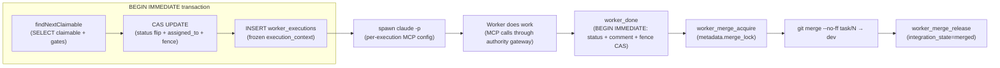

# 02 — Data & Integration Analysis

> Phase 2. Entry/exit points, data flow, event catalog, storage map.

## 2.1 Entry/Exit Points Inventory

### MCP Tool Surface (primary entry — stdio)

Every interaction between an LLM agent and saga-mcp flows through exactly one entry point: the MCP `CallToolRequest` handler in `src/index.ts:173`. The authority gateway (`authorizeSagaToolCall`) intercepts every call before dispatch.

| Category | Tools | Sync/Async | Contract source | Evidence |
|---|---|---|---|---|
| **Dispatch** | `worker_next`, `worker_done`, `worker_ask_need`, `worker_ask_done`, `worker_merge_acquire`, `worker_merge_release`, `worker_health` | Sync | `src/tools/dispatcher.ts` (1610 lines) | `BEGIN IMMEDIATE` transactions; fence enforcement |
| **CRUD** | `project_*`, `epic_*`, `task_create/list/get/update/batch_update`, `subtask_*`, `comment_*`, `template_*`, `note_*` | Sync | `src/tools/projects.ts`, `epics.ts`, `tasks.ts`, `subtasks.ts`, etc. | Standard SQLite CRUD |
| **Artifacts** | `artifact_create/get/list/update`, `trace_add/list/delete`, `artifact_coverage` | Sync | `src/tools/artifacts.ts` (885 lines) | Content-hash + drift detection; managed-production ledger stamping |
| **Lifecycle** | `verification_record`, `process_module_*`, `process_run_*`, `lifecycle_run_*`, `process_node_submit` | Sync | `src/tools/lifecycle.ts`, `process-modules.ts`, `process-node-submissions.ts` | 4-valued verdict; cross-AC rejection |
| **Saga3 Discovery** | `proposal_submit`, `normalization_*`, `readiness_*`, `diagnosis_*` | Sync | `src/tools/saga3-proposals.ts`, etc. | Factory-created handlers with injected repos |
| **Delivery** | `delivery_approval_list/get/decide` | Sync | `src/tools/delivery-approvals.ts` | Authorized decision recording |
| **Infrastructure** | `repository_*`, `observation_*`, `conflict_*`, `provider_*` | Sync | `src/tools/repositories.ts`, `observations.ts`, `conflicts.ts`, `providers.ts` | Registry patterns |
| **Board** | `tracker_init/dashboard/search/export/import`, `activity_log`, `session_diff` | Sync | `src/tools/dashboard.ts`, `search.ts`, `activity.ts`, `export-import.ts` | Read-mostly board projections |

### HTTP API (tracker-view, port 4321)

| Endpoint | Method | Sync/Async | Purpose | Evidence |
|---|---|---|---|---|
| `/` | GET | Sync | Kanban board HTML | `tracker-view.mjs` |
| `/?project=<id>` | GET | Sync | Project board | |
| `/?artifact=<id>` | GET | Sync | Artifact wiki view | |
| `/artifact/<id>/edit` | GET | Sync | Artifact editor | |
| `/api/project/create-from-idea` | POST | Async | One-shot bootstrap: project + repo + epic + lifecycle spawn | Calls `startProductLifecycleFromIdea` |
| `/api/episode/resume` | POST | Sync | Clear needs-human flag | |
| `/api/episode/pipeline` | GET | Sync | Stage progress + timestamps | |
| `/api/episode/stage-summary` | GET | Async | Stage summary (may spawn `summary.stage` task) | |
| `/api/workers/active` | GET | Sync | Active workers from `worker_executions` | |
| `/api/worker/tail` | GET | Sync | Safe JSONL tail (path-traversal guarded) | |
| `/api/engine/restart` | POST | Async | Restart engine with new concurrency | |
| `/api/models` | GET | Sync | Model catalog (8 models with limits) | |
| `/api/model/set` | POST | Async | Patch settings.json + episode metadata | |
| `/api/lmstudio/models` | GET | Async | Probe LM Studio `/v1/models` | |
| `/api/artifact/save` | POST | Sync | Save .md + metadata | |
| `/api/project/create`, `/api/epic/create` | POST | Sync | Admin forms | |
| `/api/project/archive`, `/api/project/delete` | POST | Sync | Soft/hard delete | |

### CLI Entry Points

| Command | Sync/Async | Purpose | Evidence |
|---|---|---|---|
| `node dist/orchestrate-cli.js <projectId> <epicId> [--concurrency=N]` | Async (long-running) | Lifecycle run loop | `src/orchestrate-cli.ts` |
| `node tools/cgad-spec-lint.mjs <dbPath>` | Sync | CGAD invariant audit | `tools/cgad-spec-lint.mjs` |
| `npm test` | Sync | 231 test files via `node --test` | `package.json` |
| `npm run test:architecture` | Sync | Ratchet + race + boundary tests | `package.json` |

### Exit Points (system → external)

| Exit | Destination | Trigger | Evidence |
|---|---|---|---|
| `spawn(claudePath, args)` | Claude CLI process | `ClaudeBoardRunner.launch()` or `LmNodeExecutor` | `tracker-view/claude-runner.mjs:906` |
| `spawnSync('git', ...)` | Git CLI | Worker skills (worktree, merge) | `skills/saga-worker/SKILL.md` |
| `spawnSync('powershell'/'taskkill')` | OS process kill | `terminateVerifiedProcess()` | `src/worker-executions.ts:297-310` |
| `execFileSync('git', ['rev-parse', 'HEAD'])` | Git CLI | `resolveActiveRepositoryWithHead()` | `src/app/start-product-lifecycle-from-idea.ts:127` |
| File writes (artifacts, trackers, worktrees) | Filesystem | Workers, materializer | Various |
| HTTP fetch to LM Studio | LM Studio API | Model probe | `tracker-view.mjs` |

---

## 2.2 Data Flow Diagrams

### Primary flow: idea → release (happy path)

```mermaid
flowchart TD
    A["Sponsor: idea (one phrase)"] --> B["startProductLifecycleFromIdea"]
    B --> C["assembleProductLifecycleInput\n(deferred delivery, git HEAD)"]
    C --> D["spawn orchestrate-cli\n(SAGA_PRODUCT_LIFECYCLE_INPUT_JSON)"]

    D --> E["LifecycleOrchestrator.run"]
    E --> F["Stage: initial-discovery\n(Discovery module)"]

    F --> F1["LM: produce-proposal\n(claude -p spawned)"]
    F1 --> F2["Kernel: resolve-proposal-submission\n(read exact raw submission)"]
    F2 --> F3{"Accepted?"}
    F3 -->|No| F4["Kernel: prepare-normalization\n→ LM: normalize-semantic"]
    F4 --> F2
    F3 -->|Yes| F5["Kernel: prepare-readiness\n→ LM: assess-readiness"]
    F5 --> F6["Kernel: resolve-readiness"]
    F6 --> F7["Kernel: settle\n(pure policy v1 → certificate)"]

    F7 --> G["Stage: solution-formalization\n(Formalization module)"]
    G --> G1["LM: define-product-contract → Kernel: resolve-product"]
    G1 --> G2["LM: model-use-cases → Kernel: resolve-use-cases"]
    G2 --> G3["LM: define-acceptance-contract → Kernel: resolve-acceptance"]
    G3 --> G4["LM: reconcile-what → Kernel: resolve-reconciliation"]
    G4 --> G5["Kernel: freeze-acceptance-baseline"]
    G5 --> G6["LM: define-architecture → Kernel: resolve-architecture"]
    G6 --> G7["Kernel: settle-formalization\n(solution contract certificate)"]

    G7 --> H["Stage: solution-development\n(Development module)"]
    H --> H1["LM: plan-task-graph → Kernel: resolve-task-graph\n(materialize kanban tasks)"]
    H1 --> H2{"areProjectedTasksTerminal?"}
    H2 -->|No| H3["PAUSE: distributeQueuedTasks\n(workers claim via worker_next)"]
    H3 --> H4["Workers: code → review → merge\n(worktree isolation, build-gate)"]
    H4 --> H2
    H2 -->|Yes| H5["Kernel: settle-development\n(verified integration bundle)"]

    H5 --> I["Stage: delivery-release\n(Delivery module)"]
    I --> I1["Kernel: preflight-release"]
    I1 --> I2["Human: approve-release"]
    I2 --> I3["Kernel: publish-deploy\n(external providers)"]
    I3 --> I4["Kernel: observe-release"]
    I4 --> I5["Kernel: settle-delivery\n(release record certificate)"]

    I5 --> J["Terminal: released"]
```



### Critical path: worker claim → done → merge



### Data transformation: raw LM output → authoritative certificate

```
claude -p stdout (stream-json)
  → proposal_submit (MCP tool call, authority-gated)
    → insertRawSubmission (raw_payload → parsed_payload, deterministic normalization)
      → if accepted_deterministically: INSERT saga3_proposals (canonical JSON, content_hash)
      → if normalization_required: createNormalizationControl → LM normalize → normalization_submit
    → Kernel handler reads exact proposal by id+hash (NEVER "latest by epic")
      → builds DiscoverySettlementInputSnapshot (proposal + readiness + policy)
      → computeInputHash (SHA-256 over canonical JSON of snapshot)
      → policy.settle(snapshot) → decision {go, clarify, reject}
      → INSERT saga3_discovery_settlements (status=computed)
      → INSERT saga3_discovery_outcome_certificates (write-once, certificate_hash)
      → UPDATE settlement status=certificate_issued
    → NodeProduction { schema, artifactRef, contentHash, bindings }
    → ModuleCompletion { outcome, outputEnvelope: { certificateRef: ProductRef } }
```

---

## 2.3 Event Catalog

The system is **NOT event-driven** in the architectural sense. It uses an **append-only audit log** (`activity_log` table) and a **command receipt ledger** (`command_receipts` + `lifecycle_events`), but these are observability/audit surfaces, not event-driven routing.

| "Event" | Publisher | Subscriber(s) | Delivery | Idempotency | Classification |
|---|---|---|---|---|---|
| `activity_log` row | Every tool handler (via `logActivity`) | tracker-view UI (read-only) | At-least-once (INSERT) | N/A (append-only) | **Audit log**, not event |
| `command_receipts` row | `worker_done` (via `storeReceipt`) | Replay detection on retry | Exact (command_id + payload_hash) | `checkReceipt` → return stored reply | **Idempotency ledger** |
| `lifecycle_events` row | `releaseExecutionAtomically` | None (audit only) | At-least-once (INSERT IGNORE) | command_id UNIQUE | **Audit trail** |
| `human_requests` row | `worker_ask_need` | `worker_ask_done` | CAS (state='open' → 'answered') | One open request per task | **State machine**, not event |
| `integration_intents` row | `worker_done` (APPROVED) | `worker_merge_release` | CAS (state transition) | intent_key UNIQUE | **State machine** |
| `verification_evidence` row | `verification_record` | Settlement policies | At-least-once (INSERT OR IGNORE) | (task, artifact, hash, execution) UNIQUE | **Evidence store** |
| `runtime_observations` row | `observation_record` | R16 lint rule | Append-only | N/A | **Append-only store** |

**Key distinction:** The system has NO event bus, NO pub/sub, NO async event handlers. All routing is **synchronous and declarative** — the LifecycleOrchestrator reads `outcomeRoutes` from the LifecycleDefinition and routes deterministically. The "events" in `lifecycle_events` are an audit trail of what already happened, not triggers for future action. This is a **correct design choice** for a governance system where determinism is paramount.

---

## 2.4 Data Storage & Classification Map

### Storage technology

- **SQLite** (better-sqlite3 12.6), WAL journal mode, `foreign_keys=ON`, `busy_timeout=5000`, `synchronous=NORMAL`.
- Single file (`DB_PATH` env var). No encryption at rest. No replication.
- ~30 base tables + ~15 saga3-specific tables.

### Schema overview (grouped by domain)

| Domain | Tables | Purpose | Evidence |
|---|---|---|---|
| **Board** | `projects`, `epics`, `tasks`, `subtasks`, `task_dependencies`, `comments`, `templates`, `notes`, `activity_log` | Kanban board core | `src/schema.ts:1-289` |
| **Repos** | `repositories`, `project_repositories`, `repository_checkouts` | Git repo bindings | `src/schema.ts:18-56` |
| **Episode** | `episode_workflows`, `lifecycle_execution_controls`, `supervision_locks` | Per-epic engine state, model route | `src/schema.ts:94-105`, `:1031-1077` |
| **Artifacts** | `artifacts`, `artifact_traces`, `verification_evidence`, `runtime_observations`, `task_conflict_keys`, `trusted_providers` | Requirements/design artifacts + CGAD | `src/schema.ts:296-510` |
| **Worker** | `worker_executions`, `command_receipts`, `lifecycle_events`, `task_work_items`, `work_attempts`, `human_requests`, `integration_intents` | Passive-worker kernel | `src/schema.ts:162-710` |
| **Process Modules** | `saga3_process_runs`, `saga3_node_runs`, `saga3_protocol_runs`, `saga3_call_instances`, `saga3_managed_*_productions` | Generic process runtime | `src/db.ts:145-211`, `sqlite-*-repository.ts` |
| **Saga3 Discovery** | `saga3_work_intents`, `saga3_raw_submissions`, `saga3_proposals`, `saga3_control_intents`, `saga3_normalization_proposals`, `saga3_readiness_*`, `saga3_discovery_*` | Discovery D1-D5 | `src/schema.ts:720-955` |
| **Lifecycle** | `saga3_lifecycle_runs`, `saga3_lifecycle_stage_runs`, `saga3_module_installations`, `saga3_scenario_*` | Lifecycle + package install | `src/schema.ts:991-1027` |
| **Package Store** | Filesystem (`.saga/package-store/`) + `saga3_module_installations` | Content-addressed module packages | `src/process-modules/installation/` |

### Sensitive data classification

| Data class | Location | PII? | Encryption | Evidence |
|---|---|---|---|---|
| Product idea / brief text | `artifacts.metadata.brief_payload` | Potentially (depends on idea content) | None | `src/tools/artifacts.ts:199-211` |
| Worker prompts (claude -p) | In-memory only (stdin pipe) | No | N/A | `claude-runner.mjs:937-943` |
| Worker JSONL logs | `~/.zcode/cli/board-runs/*.jsonl` | Potentially (model output may contain user data) | None (filesystem) | `claude-runner.mjs:944-947` |
| Model API keys | `~/.claude/settings.json` (env) | No (credentials) | Filesystem permissions only | `claude-runner.mjs:895-905` |
| Git credentials | OS-managed | No | OS-managed | N/A |

**PII/retention gap:** No data retention policy is enforced in code. Worker logs accumulate indefinitely. No automatic purging of `activity_log`, `worker_executions`, or `lifecycle_events`. This is an **open gap** — flagged as requiring stakeholder input.
