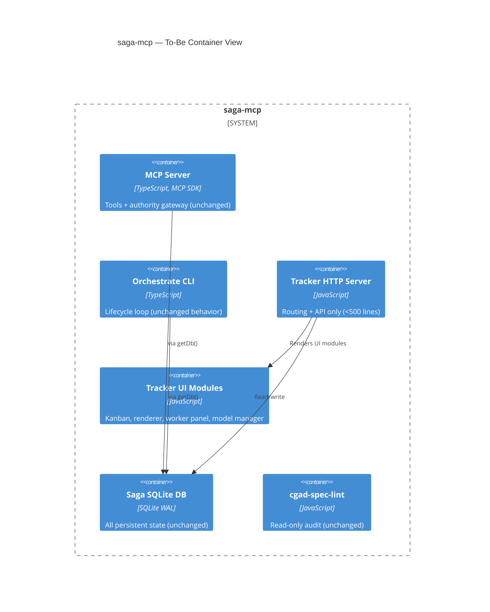

# 05 — Vision, Target State & Gap Analysis

> Phase 5. Product vision hypothesis, target architecture, To-Be C4, gap map.

## 5.1 Product Vision Hypothesis (UNVERIFIED — pending stakeholder confirmation)

> ⚠️ This is a **hypothesis** derived from observed behavior, not a confirmed
> product statement. It must be validated with the project owner before any
> decision is based on it.

**Hypothesis:** saga-mcp aims to be the governance layer that makes it
impossible for parallel LLM coding agents to produce invalid work — by
enforcing contract-governed transitions, independent verification, and
deterministic settlement at every stage from idea to release. The target
user is a developer or small team who wants to delegate software
construction to AI agents while maintaining architectural integrity and
auditability.

**Evidence supporting this hypothesis:**
- README: "Goal: make it impossible to pass an invalid action as a valid transition."
- CGAD spec: 25 forbidden constructs, deny-by-default, 4-valued verdict.
- Architecture: ratchet tests that only tighten, content-addressed products.
- Skills: every role has explicit forbidden actions and authority scope.

**Evidence that might contradict it:**
- The system also functions as a kanban tracker and markdown wiki (tracker-view).
- The "governance" layer is deeply intertwined with Claude CLI specifically (not LLM-agnostic in practice).
- The CGAD spec is aspirational (v0.95) — not all 25 forbidden constructs are enforced.

**Open question for stakeholder:** Is the primary value proposition
"governance for LLM agents" or "autonomous software factory" or "CGAD
reference implementation"? The answer significantly affects target
architecture priorities.

---

## 5.2 Target Solution Design + ADRs

### Target architecture: Hexagonal Modules + Filter Pipeline Runtime

The target state preserves everything that is correct in the current
architecture (Phase 1 §C1-C6) and addresses the anti-patterns (Phase 1
§A1-A6, V1-V3) through physical reorganization, not behavioral change.

**Core principle:** Each Process Module becomes a self-contained hexagon
(ports + adapters + domain + application) in a single directory tree. The
runtime is a filter pipeline that does not know module names.

### ADR-T1: Module as self-contained hexagon

**Status:** Proposed
**Context:** Currently, a module's code is spread across 4-5 directories
(`modules/<name>/`, `saga3/`, `infrastructure/process-modules/`,
`shared/`). An agent must read files from all of them to understand one
module. This creates a context-window glass ceiling (Phase 1 §A4, §A6).
**Decision:** Each module lives entirely under `modules/<name>/` with
domain/application/infrastructure/package subdirectories. The module
exports one `register(deps)` function. Composition root calls it and
passes shared infrastructure.
**Consequences:**
- Positive: module is understandable in isolation; composition root drops from 780 to ~80 lines.
- Negative: requires physical file moves (large diff); `saga3/` directory is dissolved.
- Trade-off accepted: one-time migration cost vs permanent context-cost reduction.

### ADR-T2: Dissolve saga3/ bounded context

**Status:** Proposed
**Context:** `saga3/` is a separate bounded context that Discovery depends
on via both static re-exports and dynamic imports (Phase 1 §A6, §V2). This
leak is documented but not fixed.
**Decision:** Distribute `saga3/` contents:
- `saga3/domain/discovery-*` → `modules/discovery/domain/`
- `saga3/application/` → `modules/discovery/application/`
- `saga3/persistence/` → `modules/discovery/infrastructure/`
- `saga3/authority/` → `shared/authority/` (cross-cutting, not Discovery-owned)
- `saga3/shared/` → `shared/canonical-json.ts` (consolidate)
**Consequences:**
- Discovery module becomes self-contained.
- `shared/authority/` is a new cross-cutting concern (justified: authority is used by ALL modules, not just Discovery).
- Dynamic import bridge (`createLegacySettlementBridge`) is deleted.

### ADR-T3: Consolidate shared interfaces

**Status:** Proposed
**Context:** `ManagedProductionLedger` is duplicated in two module kernel-ports files (Phase 1 §A2).
**Decision:** Extract to `shared/managed-production.ts` as the canonical interface. Modules import from there.
**Consequences:** Eliminates silent drift risk. One source of truth.

### ADR-T4: Remove dead v1 path from GenericFlowExecutor

**Status:** Proposed
**Context:** After Wave 5 cutover, v1 NodeRun path is dead code (~400 lines, Phase 4 §Wave debt).
**Decision:** Delete v1 path, v2 detection, dual-write logic. v2 is the only path.
**Consequences:** GenericFlowExecutor drops from ~1482 to ~600 lines. Characterization tests must prove no regression.

### ADR-T5: Extract Wave-archaeology comments to ADR log

**Status:** Proposed
**Context:** 30-40% of key files is Wave-history commentary (Phase 4 §Comment ratio).
**Decision:** Move all Wave/FU/Slice history comments to `docs/architecture/WAVE-LOG.md`. Source files carry behavioral documentation only.
**Consequences:** Immediate context-cost reduction for agents and humans. Wave history preserved in versioned ADR.

### ADR-T6: Split tracker-view.mjs

**Status:** Proposed
**Context:** 5605-line God Object (Phase 1 §V1).
**Decision:** Split into:
- `http-server.mjs` — HTTP routing, endpoint handlers
- `kanban-board.mjs` — Board rendering, card rendering
- `markdown-renderer.mjs` — MD → HTML
- `worker-panel.mjs` — Live workers, tail, heartbeat
- `model-manager.mjs` — Model catalog, LM Studio probe
- `admin-api.mjs` — Project/epic create, lifecycle bootstrap
**Consequences:** Each file <1000 lines. SRP restored.

### ADR-T7: Fix type cycle at SPI level

**Status:** Proposed
**Context:** `ModuleCompletion ↔ ProcessModuleOutputEnvelope` type cycle requires `null as unknown as` workaround (Phase 1 §A3).
**Decision:** Introduce a `CompletionEnvelope` intermediary type that does not reference back to `ProcessModuleOutputEnvelope`. The envelope carries `completionRef: ProductRef` directly; the back-reference is removed from the type model.
**Consequences:** No more `as unknown as`. Serialization is natural.

---

## 5.3 To-Be C4

### To-Be — Context (unchanged from As-Is)

The system context does not change — the same external actors and systems interact with saga-mcp. The transformation is internal.

### To-Be — Container



### To-Be — Component (Process Module layer)

```mermaid
C4Component
    title saga-mcp — To-Be: Module Hexagons

    Container_Boundary(runtime, "Generic Runtime")
    Component(gfe, "GenericFlowExecutor", "~600 lines (v1 removed)")
    Component(lo, "LifecycleOrchestrator", "Declarative routing")
    Component(wa, "Work Assignment", "findNextClaimable + atomic-release")

    Container_Boundary(discovery, "modules/discovery/ (self-contained hexagon)")
    Component(dDomain, "domain/", "settlement-policy, certificate, proposal types")
    Component(dApp, "application/", "kernel-handlers, settlement-service, ports")
    Component(dInfra, "infrastructure/", "SQLite adapters (implement ports)")
    Component(dPkg, "package/", "manifest, resources, skills, templates")
    Component(dIndex, "index.ts", "register(sharedDeps) → DiscoveryInstallation")

    Container_Boundary(formalization, "modules/formalization/ (self-contained hexagon)")
    Component(fDomain, "domain/", "schemas, settlement policy types")
    Component(fApp, "application/", "7 kernel handlers, ports")
    Component(fInfra, "infrastructure/", "SQLite adapters")
    Component(fPkg, "package/", "manifest, resources, skills")
    Component(fIndex, "index.ts", "register(sharedDeps)")

    Container_Boundary(shared, "shared/ (cross-cutting)")
    Component(sAuth, "authority/", "authorize-saga-tool-call, execution-context")
    Component(sCanon, "canonical-json.ts", "canonicalJson, sha256Hex")
    Component(sLedger, "managed-production.ts", "ManagedProductionLedger interface")

    Rel(gfe, dApp, "Dispatches to handler registry")
    Rel(gfe, fApp, "Dispatches to handler registry")
    Rel(dIndex, sAuth, "Imports cross-cutting authority")
    Rel(dIndex, sCanon, "Imports canonical primitives")
    Rel(dIndex, sLedger, "Imports shared interface")
    Rel(dInfra, sLedger, "Implements shared interface")
    Rel(fInfra, sLedger, "Implements shared interface")
```

---

## 5.4 Gap Map (As-Is vs. To-Be)

Prioritized by risk × value. Each gap maps to a Phase 6 execution step.

| # | Gap | As-Is | To-Be | Risk if unfixed | Value if fixed | Priority |
|---|---|---|---|---|---|---|
| G1 | Wave-archaeology in source | 30-40% comment density | Extracted to WAVE-LOG.md | High context cost for agents | ~30% context savings | **P0** |
| G2 | Dead v1 path in executor | ~400 lines dead code | Removed | Confusion, maintenance burden | Executor drops to ~600 lines | **P0** |
| G3 | saga3/ cross-tree leakage | Dynamic import workaround | Discovery hexagon self-contained | Module not autonomous | Agent can understand module in isolation | **P1** |
| G4 | Composition root 780 lines | Manual wiring | register(deps) per module | Shotgun surgery for new module | 90% reduction; linear scaling | **P1** |
| G5 | Duplicated interfaces | ManagedProductionLedger ×2 | One canonical shared interface | Silent drift | Structural integrity | **P1** |
| G6 | Type cycle workaround | `null as unknown as` | Intermediary type | Fragile serialization | Clean type model | **P2** |
| G7 | tracker-view God Object | 5605 lines, 1 file | 5-6 modules <1000 lines each | SRP violation | Maintainability | **P2** |
| G8 | `as any` in composition | Type safety bypass | Properly typed registration | Runtime errors from bad wiring | Type safety at boundary | **P2** |
| G9 | No data retention policy | Indefinite accumulation | Retention policy + purging | Disk growth | Operations hygiene | **P3** |
| G10 | No real-LM integration test | mock-claude only | Smoke test with real `claude -p` | Production surprises | Confidence | **P3** |
| G11 | SQLite single-process ceiling | Single file, single process | Stakeholder decision needed | Cannot scale beyond one machine | Multi-host option (future) | **P3** (stakeholder) |
| G12 | No HTTP auth on tracker-view | Localhost only | Token auth if exposed | If port forwarded, open access | Security hardening | **P3** |
